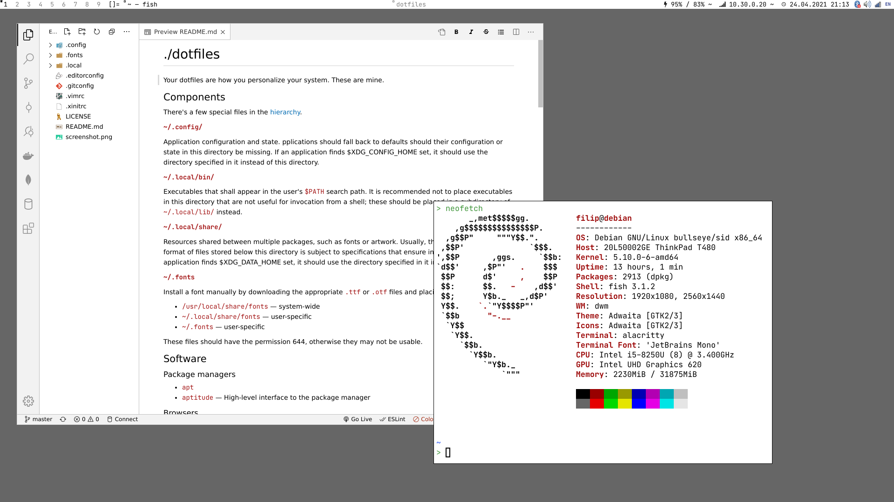

# ./dotfiles

Your dotfiles are how you personalize your system. These are mine.

## Components

There's a few special files in the
[hierarchy](https://www.freedesktop.org/software/systemd/man/file-hierarchy.html).

**`~/.config/`**

Application configuration and state. pplications should fall back to defaults
should their configuration or state in this directory be missing. If an
application finds $XDG_CONFIG_HOME set, it should use the directory specified in
it instead of this directory.

**`~/.local/bin/`**

Executables that shall appear in the user's `$PATH` search path. It is
recommended not to place executables in this directory that are not useful for
invocation from a shell; these should be placed in a subdirectory of
`~/.local/lib/` instead.

**`~/.local/share/`**

Resources shared between multiple packages, such as fonts or artwork. Usually,
the precise location and format of files stored below this directory is subject
to specifications that ensure interoperability. If an application finds
$XDG_DATA_HOME set, it should use the directory specified in it instead of this
directory.

**`~/.fonts`**

Install a font manually by downloading the appropriate `.ttf` or `.otf` files and
placing them into:

- `/usr/local/share/fonts` — system-wide
- `~/.local/share/fonts` — user-specific
- `~/.fonts` — user-specific

These files should have the permission 644, otherwise they may not be usable.

## Software

### Package managers

- `apt`
- `aptitude` — High-level interface to the package manager

### Browsers

- `chromium`
- `firefox`
- `links` — Lynx-like alternative character mode WWW browser

### Office

- `onlyoffice` — Office suite
- `pandoc` — Universal markup converter
- `pdftk` — A handy tool for manipulating PDF
- `troff` — Processor of the groff text formatting system
- `poppler-utils` — Manipulation tools for pdf
    - `pdfdetach` — lists or extracts embedded files (attachments)
    - `pdffonts` — font analyzer
    - `pdfimages` — image extractor
    - `pdfinfo` — document information
    - `pdfseparate` — page extraction tool
    - `pdfsig` — verifies digital signatures
    - `pdftocairo` — PDF to PNG/JPEG/PDF/PS/EPS/SVG converter using Cairo
    - `pdftohtml` — PDF to HTML converter
    - `pdftoppm` — PDF to PPM/PNG/JPEG image converter
    - `pdftops` — PDF to PostScript (PS) converter
    - `pdftotext` — text extraction
    - `pdfunite` — document merging tool

### Monitors

- `arandr` — Another XRandR GUI
- `light` — Backlight controllers
- `mons` — POSIX Shell script to quickly manage monitors on X
- `xbacklight` — Adjust backlight brightness using RandR extension

### Audio

- `alsamixer` — Graphical mixer program for the Linux Sound Architecture
- `amixer` — Command-line control of the mixer for the ALSA soundcard driver
- `audacity` — Audacity is open-source digital audio editor and recording application

### System tray

- `blueman-applet` — Blueman applet
- `ibus` — Intelligent Input Bus for Linux/Unix
- `nm-applet` — GTK‐based GUI applet to monitor network status and devices
- `pasystray` — PulseAudio system tray

### Media

- `calibre` — Suite of e-book
- `gimp` — Raster graphics editor
- `imagemagick` — Suite for the creation, modification and display of bitmap images
- `inkscape` — Vector graphics editor
- `mpv` — Media player software based on MPlayer, mplayer2 and FFmpeg
- `sxiv` — Simple X Image Viewer
- `vlc` — Media player, supports many audio and video compression

### Development

- `alacritty` — GPU accelerated terminal emulator
- `code` — Visual Studio Code, open-source editor made by Microsoft
- `entr` — Run arbitrary commands when files change
- `git-lfs` — Git Large File Storage (LFS)
- `gitg` — GNOME GUI client to view git repositories
- `insomnia` — API Client platform for GraphQL and REST
- `minicom` — Friendly serial communication program
- `mysql-workbench` — MySQL Workbench is a visual database design tool
- `netcat` — Networking utility for reading from and writing to network connections using TCP or UDP
- `objdump` — Display information from object files
- `plantuml` — Intuitive language for defining diagrams
- `postman` — API Client platform for GraphQL and REST
- `scrcpy` — Display and control your Android device
- `smu` — Simple markdown like syntax converter to HTML
- `vim` — Simple text editor
- `xxd` — Creates a hex dump of a given file or standard input

### Networking

- `network-manager-pptp` — PPTP support for NetworkManager
- `nmtui` — Text User Interface for controlling NetworkManager

### Printers

- `simple-scan` — Simple scanning utility
- `system-config-printer` — Graphical user interface for CUPS administration

### Other

- `apg` — Generates several random passwords
- `blueman` — GTK+ Bluetooth Manager
- `fd` — Fast and user friendly alternative to find
- `font-manager` — Simple font manager
- `grabc` — Grab the color of some pixel in X11
- `lf` — Terminal file manager
- `lxappearance` — Standard theme switcher of LXDE
- `mktemp` — Create a temporary file or directory
- `picom` — A lightweight compositor for X11
- `powertop` — Measure, explain and minimise electrical power consumption
- `xclip` — Command line interface to the X11 clipboard

### Suckless

<https://suckless.org/>

- `dmenu` — Dynamic menu for X
- `dwm` — Dynamic window manager for X
- `sent` — Simple plaintext presentation tool
- `slock` — Simple X display locker
- `st` — Simple terminal implementation for X
- `surf` — Simple web browser based on WebKit2/GTK+

#### Patches

**`dwm`** — <https://dwm.suckless.org/patches/>

- alwayscenter
- awesomebar
- focusonnetactive
- fullscreen
- movestack
- noborder
- pertag
- scratchpad
- statusallmons
- systray
- warp

**`dmenu`** — <https://tools.suckless.org/dmenu/patches/>

- border
- center

## Links

- <http://dotshare.it/>
- <https://github.com/alebcay/awesome-shell>
- <https://github.com/dikiaap/dotfiles>
- <https://github.com/inputsh/awesome-linux>
- <https://github.com/jlevy/the-art-of-command-line>
- <https://github.com/johnjago/dotfiles>
- <https://github.com/kaihendry/dotfiles>
- <https://github.com/LukeSmithxyz/voidrice>
- <https://github.com/luong-komorebi/Awesome-Linux-Software>
- <https://github.com/mitchweaver/suckless>
- <https://github.com/rwxrob/dotfiles>
- <https://github.com/saleone/configs>
- <https://google.github.io/styleguide/shellguide.html>
- <https://jacekkowalczyk.wordpress.com/2018/11/20/how-to-install-dwm-from-suckless-org-at-fedora-29/>
- <https://johnjago.com/blog/dwm/>
- <https://suckless.org/rocks/>
- <https://www.freedesktop.org/software/systemd/man/file-hierarchy.html>
- <https://www.reddit.com/r/unixporn/>
